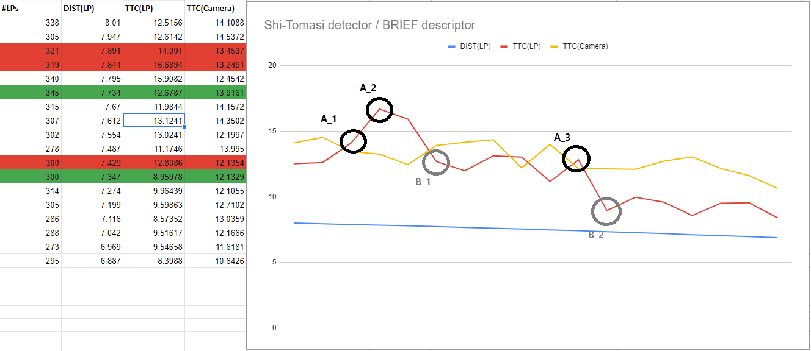

# SFND 3D Object Tracking

## 1. Project Overview


**(Click [here](https://github.com/mgtruuuu/Udacity-Sensor_Fusion_Nanodegree_Program-project-02-Camera_Based_2D_Feature_Tracking) to check the mid-term project, which deals with yellow box.)**

This project (final project, **Tracking 3D bounding boxese and computing refined TTC**)  covers the following key concepts:

- Keypoint detectors, descriptors and methods to match them between successive images
- YOLO deep-learning framework (to detect objects in an image)
- Associating regions in a camera image with Lidar points in 3D space
- Associating keypoint matches to regions of interest and then computing the TTC based on those matches 


## 2. Key Implementation

### FP.1 Match 3D Objects

Implement the method "`matchBoundingBoxes`", which takes as input both the previous and the current data frames and provides as output the ids of the matched regions of interest (i.e. the `boxID` property). Matches must be the ones with the highest number of keypoint correspondences.

```c++
std::map<int, int> bbBestMatches;
matchBoundingBoxes(it_curr->getKPMatches(), it_prev->getKeypoints(), it_curr->getKeypoints(), it_prev->getBoundingBoxes(), boundingBoxes, bbBestMatches);
it_curr->setBBMatches(bbBestMatches);
```

```c++
void matchBoundingBoxes(const std::vector<cv::DMatch>& curr_KPMatches, const std::vector<cv::KeyPoint>& prev_KPs, const std::vector<cv::KeyPoint>& curr_KPs, const std::vector<BoundingBox>& prev_BBoxes, const std::vector<BoundingBox>& curr_BBoxes, std::map<int, int>& bbBestMatches) {

    using prevBBoxID2Count = std::map<int, int>;            
    using currBBoxID2Map = std::map<int, prevBBoxID2Count>; 
    currBBoxID2Map matrix_2D;       // map : (currBBoxID, prevBBoxID) -> #(KPMatches in pair of BBoxes)

    for (const auto& match : curr_KPMatches) {

        const cv::KeyPoint curr_KP{ curr_KPs[match.trainIdx] };  // prevFrame.keypoints is indexed by queryIdx.
        const cv::KeyPoint prev_KP{ prev_KPs[match.queryIdx] };  // currFrame.keypoints is indexed by trainIdx.

        for (const auto curr_BBox : curr_BBoxes) {
            if (curr_BBox.roi.contains(curr_KP.pt) == false)      continue;

            for (const auto prev_BBox : prev_BBoxes) {
                if (prev_BBox.roi.contains(prev_KP.pt) == false)  continue;

                matrix_2D[curr_BBox.boxID][prev_BBox.boxID] += 1;
            }
        }
    }

    auto findKeyWithLargestValue{ [](std::map<int, int>& sampleMap) {

            std::pair<int, int> entryWithMaxValue{ std::make_pair(0, 0) };

            for (auto it{ sampleMap.begin() }; it != sampleMap.end(); ++it)
                if (it->second > entryWithMaxValue.second)
                    entryWithMaxValue = std::make_pair(it->first, it->second);

            return entryWithMaxValue.first;
        }
    };

    for (auto currBBoxID{ matrix_2D.begin() }; currBBoxID != matrix_2D.end(); ++currBBoxID)
        bbBestMatches.insert({ findKeyWithLargestValue(currBBoxID->second), currBBoxID->first});
}
```


### FP.2 Compute Lidar-based TTC

Compute the time-to-collision in second for all matched 3D objects using only Lidar measurements from the matched bounding boxes between current and previous frame.

```c++
double ttcLidar;
std::pair<double, double> pair_distance{
    computeTTCLidar(prevBB->lidarPoints, currBB->lidarPoints, sensorFrameRate, ttcLidar)
};
```

```c++
std::pair<double, double> computeTTCLidar(const std::vector<LidarPoint>& lidarPointsPrev, const std::vector<LidarPoint>& lidarPointsCurr, const double frameRate, double& TTC) {

    std::vector<double> prevXvalues, currXvalues;

    for (const auto& prevLidarPoint : lidarPointsPrev)
        prevXvalues.push_back(prevLidarPoint.x);

    for (const auto& currLidarPoint : lidarPointsCurr)
        currXvalues.push_back(currLidarPoint.x);


    // Use medean value.
    std::nth_element(prevXvalues.begin(), prevXvalues.begin() + prevXvalues.size() / 2, prevXvalues.end());
    std::nth_element(currXvalues.begin(), currXvalues.begin() + currXvalues.size() / 2, currXvalues.end());
    const double dist_prev{ prevXvalues[prevXvalues.size() / 2] };
    const double dist_curr{ currXvalues[currXvalues.size() / 2] };

    
    const double dT{ 1 / frameRate };
    TTC = (dist_curr * dT) / (dist_prev - dist_curr);

    return { dist_prev, dist_curr };
}
```

### FP.3 Associate Keypoint Correspondences with Bounding Boxes

Prepare the TTC computation based on camera measurements by associating keypoint correspondences to the bounding boxes which enclose them. All matches which satisfy this condition must be added to a vector in the respective bounding box.

```c++
clusterKptMatchesWithROI(it_prev->getKeypoints(), it_curr->getKeypoints(), it_curr->getKPMatches(), currBB);
```

```c++
void clusterKptMatchesWithROI(const std::vector<cv::KeyPoint>& kptsPrev, const std::vector<cv::KeyPoint>& kptsCurr, const std::vector<cv::DMatch>& kptMatches, BoundingBox* const boundingBox) {

    std::vector<cv::DMatch> KPsMatchesWithROI;

    // Check if the matching keypoints are within the ROI in the camera image.
    for (const auto& kptMatch : kptMatches) {
        cv::KeyPoint train{ kptsCurr[kptMatch.trainIdx] };
        const auto train_pt{ cv::Point{static_cast<int>(train.pt.x), static_cast<int>(train.pt.y) } };

        cv::KeyPoint query{ kptsPrev[kptMatch.queryIdx] };
        const auto query_pt{ cv::Point{ static_cast<int>(query.pt.x), static_cast<int>(query.pt.y) } };

        // Choose good ones.
        if (boundingBox->roi.contains(train_pt) && boundingBox->roi.contains(query_pt))
            KPsMatchesWithROI.push_back(kptMatch);
    }


    // Eliminate outliers by computing the mean of all the euclidean distances between keypoint matches.

    std::vector<float> distances;
    for (const auto& KPsMatch : KPsMatchesWithROI) {
        float normL2{ static_cast<float>(cv::norm(kptsCurr[KPsMatch.trainIdx].pt - kptsPrev[KPsMatch.queryIdx].pt)) };
        distances.push_back(normL2);
    }
    
    //const float mean_distance{ std::accumulate(distances.begin(), distances.end(), 0.0f) / distances.size() };
    std::nth_element(distances.begin(), distances.begin() + distances.size() / 2, distances.end());
    float median_distance{ distances[distances.size() / 2] };

    // Remove matches that are too far away from the mean.
    constexpr float rate{ 1.8f };
    const float upperLimit{ rate * median_distance };
    for (int it{ 0 }; it != distances.size(); ++it) {
        if (distances[it] < upperLimit) {
            // Populate boundingBox.kptMatches with the good matches.
            boundingBox->kptMatches.push_back(KPsMatchesWithROI[it]);
        }
    }
}
```


### FP.4 Compute Camera-based TTC

Compute the time-to-collision in second for all matched 3D objects using only keypoint correspondences from the matched bounding boxes between current and previous frame.

```c++
double ttcCamera;
clusterKptMatchesWithROI(it_prev->getKeypoints(), it_curr->getKeypoints(), it_curr->getKPMatches(), currBB);
computeTTCCamera(it_prev->getKeypoints(), it_curr->getKeypoints(), currBB->kptMatches, sensorFrameRate, ttcCamera);
```

```c++
void computeTTCCamera(const std::vector<cv::KeyPoint>& kptsPrev, const std::vector<cv::KeyPoint>& kptsCurr, const std::vector<cv::DMatch>& kptMatches, const double frameRate, double& TTC) {

    // Compute distance ratios on every pair of keypoints.
    std::vector<double> distRatios;
    
    for (auto it1{ kptMatches.begin() }; it1 != kptMatches.end() - 1; ++it1) {
        const cv::KeyPoint kpOuterCurr{ kptsCurr[it1->trainIdx] };        // kptsCurr is indexed by trainIdx
        const cv::KeyPoint kpOuterPrev{ kptsPrev[it1->queryIdx] };        // kptsPrev is indexed by queryIdx

        for (auto it2{ it1 + 1 }; it2 != kptMatches.end(); ++it2) {
            const cv::KeyPoint kpInnerCurr{ kptsCurr[it2->trainIdx] };    // kptsCurr is indexed by trainIdx
            const cv::KeyPoint kpInnerPrev{ kptsPrev[it2->queryIdx] };    // kptsPrev is indexed by queryIdx

            // Calculate the current and previous Euclidean distances 
            // between each keypoint in the pair.
            const double distCurr{ cv::norm(kpOuterCurr.pt - kpInnerCurr.pt) };
            const double distPrev{ cv::norm(kpOuterPrev.pt - kpInnerPrev.pt) };

            // Threshold the calculated distRatios by requiring a minimum current distance between keypoints.
            constexpr double minDist{ 100.0 };

            // Avoid division by zero and apply the threshold.
            if (distPrev > std::numeric_limits<double>::epsilon() && distCurr >= minDist) {
                const double distRatio{ distCurr / distPrev };
                distRatios.push_back(distRatio);
            }
        }
    }

    // Only continue if the vector of distRatios is not empty.
    if (distRatios.size() == 0) {
        TTC = std::numeric_limits<double>::quiet_NaN();
        return;
    }

    // Use the median as a reasonable method of excluding outliers.
    std::nth_element(distRatios.begin(), distRatios.begin() + distRatios.size() / 2, distRatios.end());
    const double median_DISTRatio{ distRatios[distRatios.size() / 2] };

    // Calculate a TTC estimate based on 2D camera features.
    const double dT{ 1 / frameRate };
    TTC = -dT / (1 - median_DISTRatio);
}
```


## 3. Performance Evaluation (FP.5,6)

- **Q.** Find examples where the TTC estimate of the Lidar sensor does not seem plausible. Describe your observations and provide a sound argumentation why you think this happened.

- **A.** 

    
    
    From a series of the camera images and lidarpoints(x-y plane) generated from the igo-car, it seems like the distance betweem two cars are getting closed. To fully see what's happening, check the slope of blue line with X-axis(time) and Y-axis(distance). It is assumed from the fact that the ego-car is braking to a halt, getting closed to the front-car with nearly constant rate of change of speed, i.e. constant acceleration `a > 0`). 

    As you can see, the result of TTC estimates doesn't make sense in some moments (See the point A and B). At the frame A, the distance between ego- and front-car is measured a bit farther than the actual distance, resulting in the next steep drop B.

    The main reason for getting some erroneous TTC values comes from applying the wrong model in this situation. In this project, Constant Velocity Model is used to calculate TTC but it not accurate enough, especially in dynamic traffic situations where a vehicle is braking hard (In this case, Constant acceleration model is required). 

    


- **Q.** Run several detector/descriptor combinations and look at the differences in TTC estimation. Find out which methods perform best and also include several examples where camera-based TTC estimation is way off. As with Lidar, describe your observations again and also look into potential reasons.

- **A.** In some combination cases, camera-based TTC estimates are so poor that it cannot be relied on to get TTC values. for example, Harris/FREAK combination produces many erroneous estimates. On the other hand, SIFT combinations and Shi-Tomasi detectors tend to produce plausible estimates even though they take much time compared to others. (data from the file(`./table/benchmark.csv`))


## 4. Dependencies for Running Locally

1. cmake >= 2.8

- All OSes: [click here for installation instructions](https://cmake.org/install/)


2. make >= 4.1 (Linux, Mac), 3.81 (Windows)

- Linux: make is installed by default on most Linux distros
- Mac: [install Xcode command line tools to get make](https://developer.apple.com/xcode/features/)
- Windows: [Click here for installation instructions](http://gnuwin32.sourceforge.net/packages/make.htm)


3. Git LFS

- Weight files are handled using [LFS](https://git-lfs.github.com/)
- Install Git LFS before cloning this Repo.

3. OpenCV >= 4.1

- All OSes: refer to the [official instructions](https://docs.opencv.org/master/df/d65/tutorial_table_of_content_introduction.html)
- This must be compiled from source using the `-D OPENCV_ENABLE_NONFREE=ON` cmake flag for testing the SIFT and SURF detectors. If using [homebrew](https://brew.sh/): `$> brew install --build-from-source opencv` will install required dependencies and compile opencv with the `opencv_contrib` module by default (no need to set `-DOPENCV_ENABLE_NONFREE=ON` manually). 
- The OpenCV 4.1.0 source code can be found [here](https://github.com/opencv/opencv/tree/4.1.0)


4. gcc/g++ >= 5.4

- Linux: gcc / g++ is installed by default on most Linux distros
- Mac: same deal as make - [install Xcode command line tools](https://developer.apple.com/xcode/features/)
- Windows: recommend using either [MinGW-w64](http://mingw-w64.org/doku.php/start) or [Microsoft's VCPKG, a C++ package manager](https://docs.microsoft.com/en-us/cpp/build/install-vcpkg?view=msvc-160&tabs=windows). VCPKG maintains its own binary distributions of OpenCV and many other packages. To see what packages are available, type `vcpkg search` at the command prompt. For example, once you've _VCPKG_ installed, you can install _OpenCV 4.1_ with the command:

    ```bash
    c:\vcpkg> vcpkg install opencv4[nonfree,contrib]:x64-windows
    ```

    Then, add *C:\vcpkg\installed\x64-windows\bin* and *C:\vcpkg\installed\x64-windows\debug\bin* to your user's _PATH_ variable. Also, set the _CMake Toolchain File_ to *c:\vcpkg\scripts\buildsystems\vcpkg.cmake*.


## 5. Basic Build Instructions

1. Clone this repo.
2. Make a build directory in the top level project directory: `mkdir build && cd build`
3. Compile: `cmake .. && make`
4. Run it: `./3D_object_tracking`.
